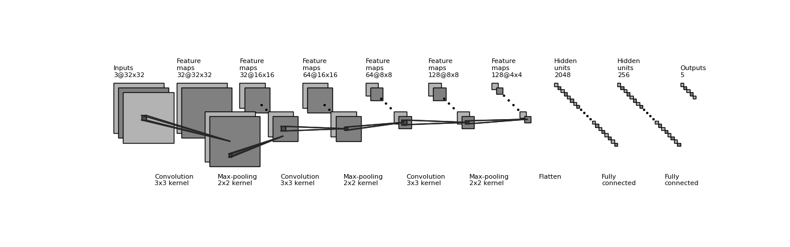

# CS-539-RoadSignDetection
CS-539 Final Project

By: Codey Battista, Avi Bissoondial, Nick Chantre, Paul Crann

# I. Problem Overview
To ensure safety and effectiveness, autonomous vehicles are ordered to obey the rules of the road. Doing so requires the vehicles to observe and adhere to stop signs, traffic lights, speed limits, or any other signage in unmapped environments. Our goal is to develop a convolutional neural network (CNN) to classify traffic signage into several classes.

# II. Dataset

In this project we utilized the full Road Sign Detection Dataset from Kaggle https://www.kaggle.com/datasets/andrewmvd/road-sign-detection consisting of 4 classes of images of different road signs. Additionally we incorporated images from the GRSTB dataset which is a well known dataset for various German road sign images. This diverse dataset consists of 43 different classes, however we selected 4 of which were consistent with the classes of our other dataset to compare the performance. The classes of sign we used were stop signs, general caution signs, crosswalk signs, traffic lights, and speedlimit signs. 

# III. Methodology

## Model Architecture

As seen in the above visualizations, the overall architecture of our model is a standard convolutional neural network with three convolutional layers, three max pooling layers, a flattening process, and then finally two fully connected layers. Below are more details of each layer.

#### Convolutional Layer 1
The input images are 32 pixels x 32 pixels with a depth of 3, and it's output dimensions are 32x32 with a depth of 32. This layer uses a 3x3 filter or kernel. This layer also applies Batch normalization, a ReLU activation function, and a dropout with 0.3 probability. This means during the training process that each neuron will have a 30% chance of being deactivated which can help reduce overfitting by forcing the model to weigh the robust features more heavily.

#### Max Pooling Layer 1
This layer takes the output image from the first convolutional layer and uses a 2x2 kernel or filter with a stride of 2. This reduces the height and weight of the outputs to 16x16.

#### Convolutional Layer 2
This layer does the same as the first convolutional layer but with different input and output sizes. The inputs of this layer are 16x16 with a depth of 32 but uses the same 3x3 kernel as before. The output dimensions are the same with a depth of 64 instead of 32. This layer also applies batch normalization, a ReLU activation function, and a dropout with 0.3 probability like before.

#### Max Pooling Layer 2
The layer takes the output image from the second convolutional layer, uses a 2x2 kernel with a stride of 2 and reduced the heights and weights for it's outputs to 8x8.

#### Convolutional Layer 3
This layer does the same as the first two convolutional layers by doubling it's depth from 64 to 128 for the output. It uses the 3x3 kernel like the above layers, and applies the same normalizaton, activation function, and dropout

#### Max Pooling Layer 3
This layer does the same thing as the first two max pooling layers. It uses a 2z2 kernel with a stride of 2 and reduces the heights and weights of it's inputs to 3x3 for the inputs. 

#### Flattening
This flattens our 4x4 output with a depth of 128 from the previous layer to a total of 2048 total units

#### Fully Connected Layer 1
This layer will take it's input of 2048 total units and reduce it to 256 units. It will also apply another dropout boht before and after, but with a probability of 0.5. 

#### Fully Connected Layer 2
This layer takes it's input of 256 and outputs 5 units. This is what was needed for the model to predict the five classes that we have for our dataset.

## Hyper Parameters

##### Loss Function: Cross Entropy Loss
##### Optimizer: Adam
##### Learning Rate: 0.001
##### Number of Epochs: 15

# IV. Results

Overall, our model showed promising results with an above 90% accuracy across the testing data

Testing loss and training loss were also very similar around 0.2 for the final few epochs. This means that the model was able to avoid overfitting the data.

When looking at the confusion matricies for our model, it was clear that the model was quite accurate on all classes but one. The class of '3' representing traffic lights was very low with an accuracy of 33% in the final epoch. We estimate that this is because this class has the smallest amount of training data with only 52 instances used for training.

